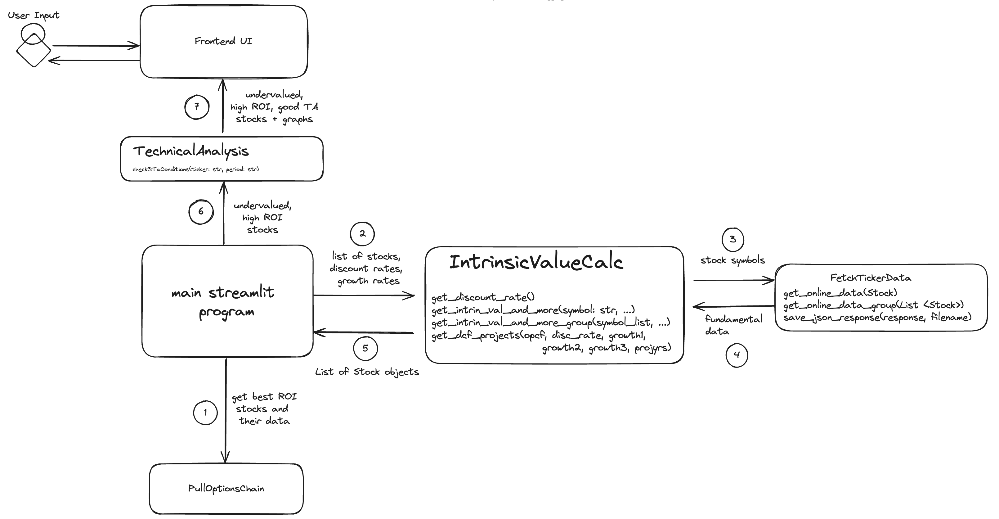
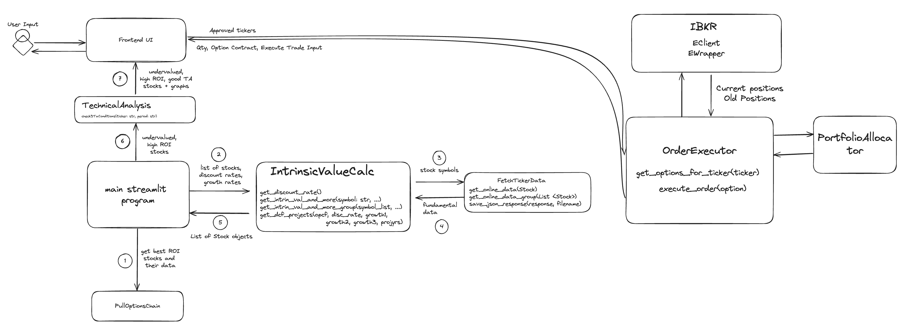

# Options trading automated

A S$30K funded project to develop an automated options trading program for two semi-retired engineers-turned-traders. The proprietary strategy generates an estimated 20% annually on a 7 figure portfolio. 

# Get started
1. Clone the repo
1. Install the requirements with `pip install -r requirements.txt`
1. Run the streamlit app with `streamlit run main.py`
1. Enjoy!

# Topics touched on in this project:
## Software Development
### Tech Stack
1. Python
1. Pandas for technical indicators
1. Streamlit
1. Selenium
1. IBKR API
1. FinanceToolkit
1. Yahoo Finance API
1. AlphaVantage API
1. RapidAPI
1. NewsAPI

### Data Structures and Algorithms
1. OOP
1. Web scraping
1. User Authentication
1. IBKR API usage (trade execution)
1. Automated trading
1. Stock valuation, screening
1. Stock market analysis

## Math/Finance
1. Options trading
1. Financial data analysis
1. Intrinsic value calculation
1. Discount rate calculation
1. Options trading strategies
1. Portfolio Optimization e.g. Efficient Frontier, Kelly Criterion
1. Black-Scholes model

# Architecture
## Phase 1: Gathering data, calculate intrinsic value of assets

## Phase 2: Gather top stock tickers from proprietary website ranked based on ROI of options. 

## Phase 3: Execute trades through IBKR that meet criteria for proprietary columns

## Phase 4: Use ML (NLP) to estimate 3-tier growth rates for companies
For this project, my original plan was to use [FinBERT](https://huggingface.co/ProsusAI/finbert), a pre-trained NLP model to analyze sentiment of financial text. It is built by further training the BERT language model in the finance domain, using a large financial corpus and thereby fine-tuning it for financial sentiment classification. 

I then switched to using GPT-4 with strict format restrictions for growth rate estimation with news articles.

# Data APIs
## NewsAPI.org use:
Limit 1000 requests per day
- docs link: https://newsapi.org/docs/get-started
- pricing link: https://newsapi.org/pricing

## AlphaVantage API use:
Limit 25 requests per day
- docs link: https://www.alphavantage.co/documentation/

## FinanceToolkit (opensource)
Limit 250 requests per day and uses FinancialModelingPrep under the hood (only US stocks) and free version only has annual data
- docs link: https://www.jeroenbouma.com/projects/financetoolkit/docs
- pypi link: https://pypi.org/project/financetoolkit/

## No longer using:
## Tiingo
Limit 1000 requests per day, max 50 per hour
- docs link: https://www.tiingo.com/documentation/fundamentals

# Regularly used terminologies
| Term | Description |
| DTE | Days to Expiry | 

# Improvements and Optimizations:
- [X] Handled missing financial data case
- [X] Fail safe: Fetch financial data from 2 sources - Tiingo and Yahoo Finance to compare 3FS discrepency. (5% tolerance)
- [X] Automate finding of discount rate as well.
- [X] Add current stock price comparison
- [X] Error handling -> if data not available. Write error message as well.
- [ ] Concurrent fetching of data
- [X] Scrape Options data from online source 
- [X] Add and apply Technical Analysis module
- [ ] Implement Kelly-Criterion for portfolio optimization
- [ ] Average growth rates for 3-tier growth rate estimation
- [X] AI sentiment analysis for growth rate estimation
- [ ] Execute trades through IBKR API
- [ ] How often does the intrinsic value change? How often should we re-calculate it? -> Can store the intrinsic value in a database and update it every 3 months.
- [X] User authentication
- [ ] Google Authenticaiton
- [ ] Score system for top options to trade
- [ ] Efficient finding of household name stocks against list of undervalued stocks.
- [ ] Bot checks all possible before deciding which ones to go for based on available portfolio. and best options ranked out of all those, considering buying power use. 
- [ ] Bot make sure its not bank

# Change log:
19 Jun:
1. Google Authentication

18 Jun: 
1. Improve Kelly Criterion calculation by agreeing on a standard way to decide how to determine "loss" amount.
1. Add points system to list of top stocks to trade
1. Pull options chain from IBKR
1. Move to Fly.io

14 Jun:
1. Implemented latest news API for growth rate estimation for individual stock analysis.
1. Used gpt-4o with strict format restrictions for growth rate estimation with news articles. 
1. Integrate TWs
1. Calculate Kelly Criterion

10 Jun:
1. Improved sortable tables and information organisation (UI updates)

6 Jun:
1. User Authentication
1. Bug fixes

4 Jun:
1. Proper API Key handling using .env file
1. Filter for only undervalued stocks
1. Changed URL to pull best ROI per day instead.
1. Added Technical Analysis module for the 3 checks
1. Added the 3 check results to table of results
1. Display price, SMAs and stochastic oscillator values in the table

29 May:
1. Webscrape with selenium from a website for highest ROI options.
1. Run intrinsic value calculation on this basket of stocks
1. Error handling of missing values from financial reports

23 May:
1. Added auto pulling of discount rate.   

22 May:
1. Fixed to Annual report data for Cashflow
1. Changed API provider with a higher API limit (AlphaVantage to Tiingo, from 25 req/day to 1000 req/day free)
1. Changed away from Tiingo after realising that their fundamental data is free only for DOW30 stocks. Trying Yahoo finance via Rapid API
1. Changed to FinanceToolkit: an open source toolkit gathering financial data with transparent methods of calculations.
1. Use YahooFinance API through RapidAPI to get current stock price

# Archive
## Public Financial data sources
1. financialmodelingprep.com 
1. https://github.com/JerBouma/FinanceToolkit
1. https://www.alphavantage.co/documentation/
1. https://www.tiingo.com/documentation/fundamentals
1. https://rapidapi.com/apidojo/api/yahoo-finance1

# Uncertain Parts/Details:
> Q: When missing financial data for some companies, for e.g. shortTermDebt is None, should we stop the calc. of Intrinsic Value?
A: Yes

# Dev Notes
### Creating requirements.txt with pipreqs: 
`$pipreqs . --encoding=iso-8859-1 --ignore optionstrader/ --force`

### After deploying to Fly, to install chrome driver to support selenium
fly ssh console -s -a options-trading-automated
apt-get update
apt-get install -y wget gnupg
wget -q -O - https://dl.google.com/linux/linux_signing_key.pub | apt-key add -
sh -c 'echo "deb [arch=amd64] http://dl.google.com/linux/chrome/deb/ stable main" > /etc/apt/sources.list.d/google-chrome.list'
apt-get update
apt-get install -y google-chrome-stable

